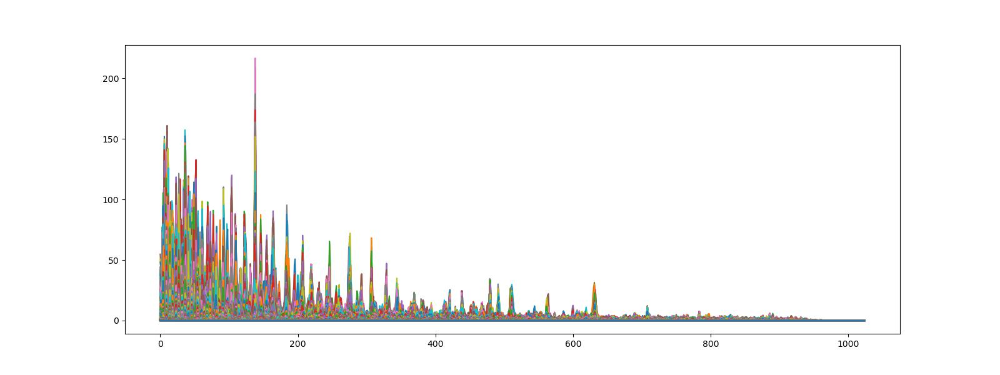
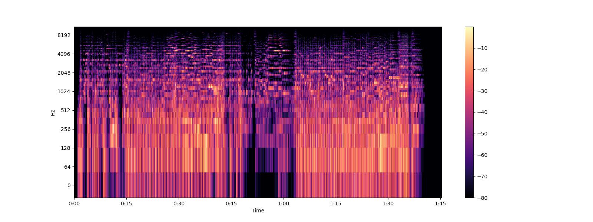

## NOTICE
- I'm no longer maintaining Repo.

<hr>

# Audio Analysis

- 오디오 데이터의 분석 기법을 정리한 Repo.<br>
*(Repo, which summarizes the analysis techniques of audio data.)*
    - FastAPI 를 통해 실행하기 편하게 구현되어 있습니다.<br> *It is implemented with FastAPI for ease of execution.*
    - requirements.txt 는 작성하지 않았습니다.
    > <b>!pip install librosa</b> etc.

- uvicorn server 실행 *(default port 9000)*
```
sh scripts/server.sh 
    or
uvicorn main:app --reload --port 9000
```

## Example. :D
- 2D 음파 그래프 코드 예시
```python
@app.post("/Audio 2D Graph/")
# FastAPI -> Audio 2D Graph 
# return StreamingResponse(BytesIO(buf.tobytes()), media_type="image/jpeg") 으로 결과 출력 
async def upload_audio_file(file: UploadFile = File(...)):
    try:
        if file.filename[-3:] in ['mp3', 'wav']:
            contents = file.file.read()
            filepath = f'static/audio/{file.filename}'
            with open(filepath, 'wb') as f:
                f.write(contents)
                
        audio = AudioAnalysis(filepath)
        audio.music_2d_graph()
        graph_image = cv2.imread('result/2D_music_graph.jpg')
        _, buf = cv2.imencode('.jpeg', graph_image)
        return StreamingResponse(BytesIO(buf.tobytes()), media_type="image/jpeg")
        
    except Exception:
        return {"Message": "There was an error uploading the file. :)"}
    finally:
        file.file.close()
        os.remove(f'static/audio/{file.filename}')
```
- Output


<hr>

- Fourier Transform 
    * 시간 영역 데이터를 주파수 영역으로 변경 : time(시간) domain -> frequency(진동수) domain 변경 시 얻는 정보가 많아져 분석 용이.
    * y축: 주파수(로그 스케일)
    * color축:데시벨(진폭)
    

<hr>

- Spectogram
    * 시간에 따른 신호 주파수의 스펙트럼 그래프
    * 다른 이름 : Sonographs, Voiceprints, Voicegrams
    

<hr>

- Mel Spectogram
    * Spectogram의 y 축을 Mel Scale로 변환한 것
    

<hr>

- Harmonic and Percussive Components
    * Harmonics : 사람의 귀로 구분할 수 없는 특징들(음악의 색깔)
    * Percussives: 리듬과 감정을 나타내는 충격파
    

<hr>

- Spectral Centroid 
    * 소리를 주파수 표현했을 때, 주파수의 가중평균을 계산하여 소리의 "무게 중심"이 어딘지를 알려주는 지표
    * 예를 들어, 블루스 음악은 무게 중심이 가운데 부분에 놓여있는 반면, 메탈 음악은 (끝 부분에서 달리기 때문에) 노래의 마지막 부분에 무게 중심이 실린다.
    

<hr>

- Spectral Rolloff
    * 신호 모양을 측정한다.
    * 총 스펙트럴 에너지 중 낮은 주파수(85% 이하)에 얼마나 많이 집중되어 있는가
    


<hr>

- Mel-Frequency Cepstral Coefficients(MFCCs)
    * MFCCs는 특징들의 작은 집합(약 10-20)으로 스펙트럴 포곡선의 전체적인 모양을 축약하여 보여준다.
    * 사람의 청각 구조를 반영하여 음성 정보 추출
    

<hr>

- Chroma Frequencies
    * 크로마 특징은 음악의 흥미롭고 강렬한 표현이다.
    * 크로마는 인간 청각이 옥타브 차이가 나는 주파수를 가진 두 음을 유사음으로 인지한다는 음악이론에 기반한다. -> 화음  인식 good
    * 모든 스펙트럼을 12개의 Bin으로 표현한다.
    * 12개의 Bin은 옥타브에서 12개의 각기 다른 반응(Semitones(반음) = Chroma)을 의미한다.
    

<hr>

```python 
print('감사합니다. Thank you! :D')
```